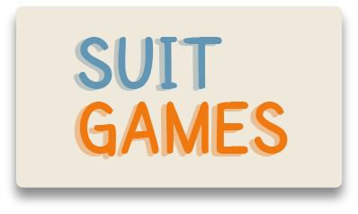

<!-- PROJECT LOGO -->
 

  

  <h2 align="center">Suit Games</h2>
  
  

    Kalahkan komputer hanya dengan orang, gajah, atau semut!
  

<!-- TABLE OF CONTENTS -->

  
Table of Contents

  <ol>
    <li><a href="#about-the-project">About The Project</a></li>
    <li><a href="#built-with">Built With</a></li>
    <li><a href="#preview">Preview</a></li>
    <li><a href="#contact">Contact</a></li>
    <li><a href="#acknowledgments">Acknowledgments</a></li>
  </ol>

<!-- ABOUT THE PROJECT -->
## About The Project

Permainan Suit Jawa or Java ‘Suit’ Games is a finger-pitting game to determine who wins first. The suit in English means ‘rock-paper-scissor’. In Java, one of ethnic in Indonesia, we have our version of the rock-paper-scissor game, that we use with elephant, human, and ant. 

This website project is upgraded from JavaScript learning series from the youtube channel “Web Programming UNPAS”. Thanks to Mr. Sandhika Galih for the course and I made this project with some upgraded features such as new UI & UX design, score calculation, and reset score features.

(<a href="#readme-top">back to top</a>)

### Built With

    	  

(<a href="#readme-top">back to top</a>)

## Preview

To visit the website, please refer to [This link](https://ginacu.github.io/website_suit_games/)

* Home
  
  

  
* About Suit Games
  
  

  
* Play The Games
  
  

(<a href="#readme-top">back to top</a>)

## Contact

Gina Cahya Utami - [LinkedIn](edin.com/in/gina-cahya-utami/) - ginacu12@gmail.com

Project Link: [https://github.com/ginacu/website_suit_games](https://github.com/ginacu/website_suit_games)

(<a href="#readme-top">back to top</a>)

<!-- ACKNOWLEDGMENTS -->
## Acknowledgments

* [Web Programming UNPAS](https://www.youtube.com/c/webprogrammingunpas)
* [Font Squirrel](https://www.fontsquirrel.com/fonts/SF-Cartoonist-Hand)
* [Icon8.com](https://icons8.com/illustrations/illustration/juicy-lying-man-playing-on-a-gaming-console)
* [Freepik.com](https://www.freepik.com/free-photo/boys-couch_4350777.htm#page=2&query=playing%20rock%20paper%20scissors%20games&position=10&from_view=search&track=ais)

(<a href="#readme-top">back to top</a>)

